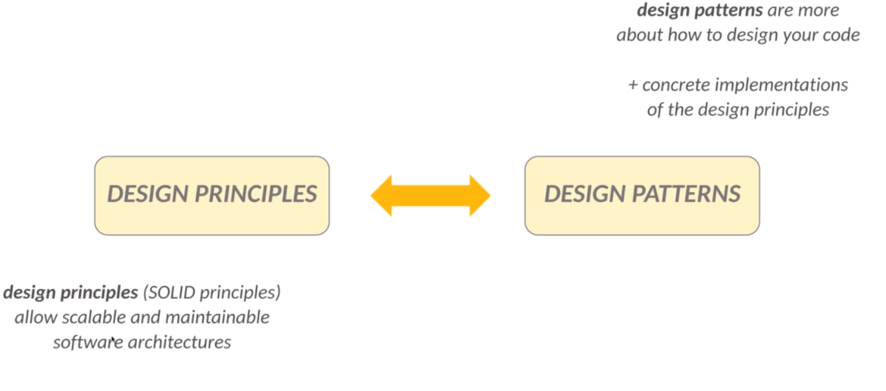
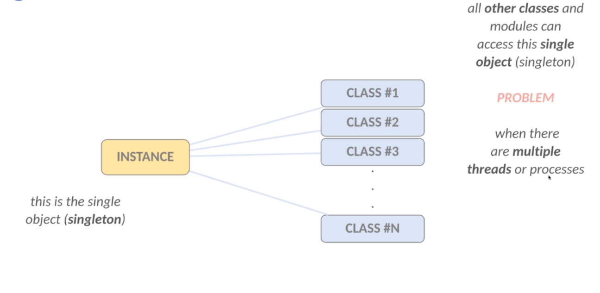
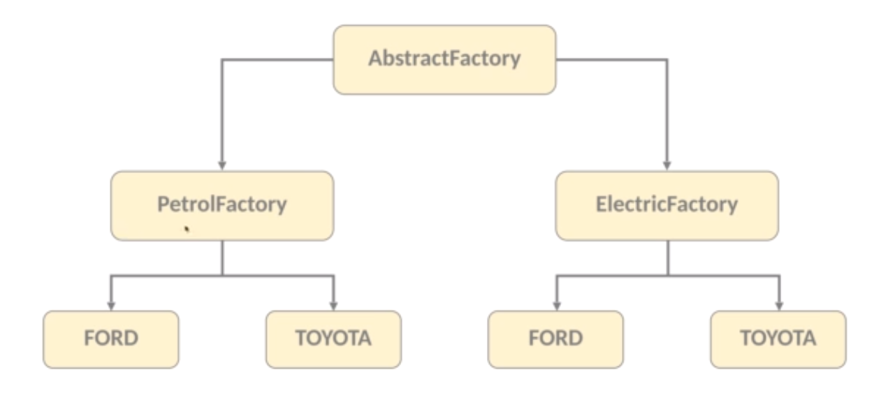
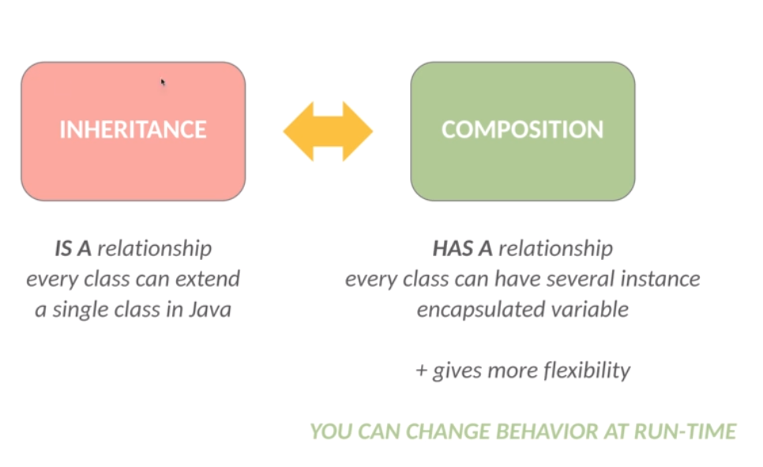
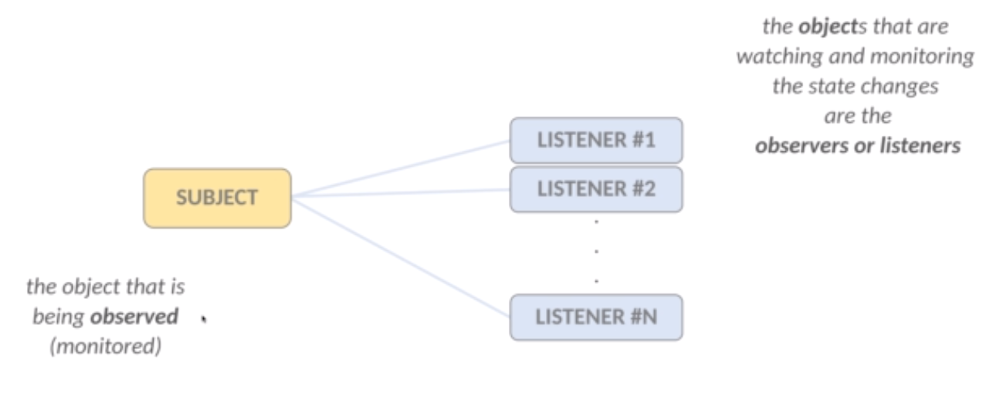

# SOLID Design Patterns Java

Software Architecture (SOLID) &amp; Design Patterns in Java

---

## What are SOLID principles?

SOID Principles

-   in software engineering SOILD is an acronym for 5 design principles.
-   why to use design patterns?
-   the aim of desgin patterns is to make software designe more understandable and maintainable.
-   these principles are mainly promoted by Robert C.Martin in his book back in 2000.

Rule:

1. single responsibility principle.
2. open - closed principle.
3. Liskov substitution principle.
4. interface segregation principle.
5. dependency inversion.

---

### Single responsibility principle

S - Single responsibility principle:

-   every single software emtity (class or method) should have only a single reason to change.
-   if a given class (or method) dose multipe operations then it is advisable to separate into distinct class (or methods).
-   it can be done easily with the help of interfaces.
-   THIS IS WHY SOILD PRINCIPLES ARE USUALLY COMBINED!!!
-   if there are 2 reason to change a given class then it is sign of violating the single responsibility principle.
-   each class or method handle just a single responsibility.
-   this is how we can achieve **loosely coupled** software components.

| TIGHT COUPLING                                                           | CLOSELY COUPLING                                                          |
| ------------------------------------------------------------------------ | ------------------------------------------------------------------------- |
| clas are highly dependent on one another                                 | classé are independent of each other                                      |
| this is typically happens when the classes have too many responsibility. | interfaces (abstraction) are quite powerful tools to achieve this feature |
|                                                                          | it can be done with the help of the SOLID priciples                       |

Single responsibility principle example:

Violation of SOILD:

```java
import java.util.Scanner;
public class App {
    public static void main(String[]args){
        System.out.println("Wellcome to application!");

        Scanner scanner = new Scanner(System.in);

        System.out.println("Enter the first number: ");
        String firstNumber = scanner.nextLine();

        System.out.println("Enter the second number: ");
        String secondNumber = scanner.nextLine();

        scanner.close();

        int firstInteger = 0;
        int secondInteger = 0;

        if (firstNumber == null) {
            System.out.println("First number is not valid...");
            return;
        }

        try {
            firstInteger = Integer.parseInt(firstNumber);
        }catch (NumberFormatException nfe) {
            System.out.println("First number is not valid...");
            return;
        }

        if (secondNumber == null) {
            System.out.println("First number is not valid...");
            return;
        }

        try {
            secondInteger = Integer.parseInt(secondNumber);
        }catch (NumberFormatException nfe) {
            System.out.println("First number is not valid...");
            return;
        }

        int result = firstInteger + secondInteger;

        System.out.println("The result is: " + result);
        System.out.println("End of the application!");
    }
}
```

Please correct it:

```java
// file InputProcessor.java

import java.util.Scanner;

public class InputProcessor {
    public static Pair process() {
        // ask the user for any input
        Scanner scanner = new Scanner(System.in);

        // get the given values
        System.out.println("Enter the first number: ");
        String firstNumber = scanner.nextLine();

        System.out.println("Enter the second number: ");
        String secondNumber = scanner.nextLine();

        // container for the value pair
        Pair pair = new Pair(firstNumber, secondNumber);

        scanner.close();

        return pair;
    }
}

// file Pair.java

public class Pair {
    private String first;
    private String second;

    public Pair(String first, String second) {
        this.first = first;
        this.second = second;
    }

    public String getFirst() {
        return first;
    }

    public String getSecond() {
        return second;
    }
}

// file ViolationChecker.java
public class ViolationChecker {

    // we have to return true if the pair components are number
    // otherwise we return false
    public static boolean isValid(Pair pair) {

        String first = pair.getFirst();
        String second = pair.getSecond();

        try {
            firstInteger = Integer.parseInt(first);
        }catch (NumberFormatException nfe) {
            System.out.println("First number is not valid...");
            return false;
        }

        try {
            secondInteger = Integer.parseInt(second);
        }catch (NumberFormatException nfe) {
            System.out.println("First number is not valid...");
            return false;
        }

        return true;
    }
}

// file Operation.java

public class Operation {
    public static int execute(int num1, int num2) {
        return num1 + num2;
    }
}

// file App.java
//import java.util.Scanner;
public class App {
    public static void main(String[]args){
        System.out.println("Wellcome to application!");

        // we can get the values
        Pair pair = InputProcessor.process();

        // check whether the inputs are fine or not
        if (!ViolationChecker.isValid(pair)) {
            System.out.println("One of the input is invalid...");
            return;
        }

        // maybe we can create a distinct class for this operation (!!!)
        int firstInteger = Integer.valueOf(pair.getFirst());
        int secondInteger = Integer.valueOf(pair.getSecond());

        // do the mathematical operation
        int result = Operation.execute(firstInteger, secondInteger);

        System.out.println("The result is: " + result);
        System.out.println("End of the application!");
    }
}
```

Exercise:

```java
public class App {
    public static final int THRESHOLD = 5;

    public static void main(String[] args) {

        System.out.println("Welcome to the Application!");

        Scanner scanner = new Scanner(System.in);

        List<Integer> nums = new ArrayList<>();

        System.out.println("Enter 5 valid integers in the range [0, 10]");

        while(nums.size() < THRESHOLD) {

            String s = scanner.nextLine();

            try {
                Integer.parseInt(s);
            } catch (NumberFormatException nfe) {
                System.out.println("Invalid! Try again!");
                continue;
            }

            int num = Integer.parseInt(s);

            if(num<0 || num > 10) {
                System.out.println("Invalid range! Try again!");
                continue;
            }

            nums.add(num);
        }

        scanner.close();

        Collections.sort(nums);

        for(int num : nums)
            System.out.print(num+" ");
    }
}
```

```java
public class App {
    public static final int THRESHOLD = 5;

    public static void main(String[] args) {

        System.out.println("Welcome to the Application!");

        // we get the inputs
        List<Integer> nums = getInputFromUser();

        // sort
        sort(nums);

        // we have do show the result
        show(nums);

    }

    private static void show(List<Integer> nums) {
        for(int num : nums)
            System.out.print(num+" ");
    }

    private static void sort(List<Integer> nums) {
        Collections.sort(nums);
    }

    private static List<Integer> getInputFromUser() {

        List<Integer> nums = new ArrayList<>();

        System.out.println("Enter 5 valid integers in the range [0, 10]");

        while(nums.size() < THRESHOLD) {

            String s = scanner.nextLine();
            if (isVaild(s))
                continue;
            nums.add(Integer.valueOf(s));
        }

        scanner.close();
        return nums;
    }

    private static boolean isVaild(String input){
        try {
            Integer.parseInt(input);
        } catch (NumberFormatException nfe) {
            System.out.println("Invalid! Try again!");
            return false;
        }

        if (num<0 || num > 10)
            return false;

        return true;
    }
}
```

### The open/closed principle introduction

O -The open/closed principle introduction

-   what is the motivation behind SOILD principle?
-   an application should take care of the frequent changes that are done during the development and the maintenace phases.
-   for example **adding new features**.
-   changes in the existing code should be **minimized**.
-   it's assumed that the existing code is **already unit tested**.
-   and changes in already written code might affect the existing functionality in an unwanted manner.
-   **open closed principle** states that the design and writing of the code should be done in a way that new functionality should be added with minimum changes in the existing code.
-   software emtities should be **open for extension** and closed for modification.
-   we have to designe every new module such that if we add a new behavior then we **do not have to change the existing modules**.
-   a class should not extend an other class explicitly - we should define a **common interface** instead.
-   we can change the classes at **runtime** due to the common interface.

There are **2** important design patterns that can guarantee that the **open closed principle** is not violated.

1. strategy pattern.
2. template pattern.

Examples:

```java

// file AlgorithmsInterviewQuestions.java

public class AlgorithmsInterviewQuestions implements InterviewQuestion{

    @Override
    public void execute() {
        System.out.println("Algorihms related questions...");
    }

}


// file AIInterviewQuestions.java

public class AIInterviewQuestions implements InterviewQuestion{

    @Override
    public void execute() {
        System.out.println("AI related questions...");
    }

}


// file InterviewQuestions.java
public interface InterviewQuestion {
    public void execute();
}


// file FinanceInterviewQuestions.java
public class FinanceInterviewQuestions implements InterviewQuestion{

    @Override
    public void execute() {
        System.out.println("Quantitative financial related questions...");
    }

}

// file InterviewQuestionProcessor.java
public class InterviewQuestionProcessor {
    public static void process(InterviewQuestion question) {
        // this is a typical implementation of the looselcy coupled system
        // this class knows nothing about the question and its type (!!!)
        // THIS IS PURE ABSTRACTION
        question.execute();
    }
}


// file App.java
public class App {
    public static void main(String[] args) {
        // InterviewQuestionProcessor.process(new AlgorithmsInterviewQuestions());
        // InterviewQuestionProcessor.process(new AIInterviewQuestions());
        InterviewQuestionProcessor.process(new CSInterviewQuestions());
    }
}


```

### Liskov substitution principle

L - Liskov substitution principle

-   what is the motivation behind the **Liskov principle**.
-   we extend sonme classes and creating some **derived classes**.
-   it would be great if the new derived classed would work as well **without replacing the funtionality** of the classes.
-   otherwise the new classes can produce undesired effects when they are used in **existing program modules**.
-   objects of superclasses shall be replaceable with objects of its subclasses **without breaking** the application.
-   that requires the objects of your **subclass to behave in the same way** as the objects of your superclass.
-   child classes should never break the parent class type definition.
-   derived types must be completely subtitutable for their base types.

There are **2** important design patterns that can guarantee that the Liskov substitution principle is not violated.

1. strategy pattern.
   **SOLID principle** are not independent of each other.
2. template pattern.
   The violation of **Liskov principle** is a latent violation of open/close principles.

### Interface segregation principle

I - Interface segregation principle

-   what is the motivation behind **interface segregation principle**?
-   sometimes we want to implement a given interface but just for the sake of some methods defined by that interface.
-   we can end up with **fat interfaces** - containing more methods than the actual class needs.
-   it is not good if an interface has a large number of methods we should separate the methods accordingly.
-   we should separate the methods accordingly.
-   no client should be forced to depend on methods it does not use.
-   when it is possible we should **break our interfaces in many smaller ones** so they better satisfy the exact needs of our clients.

### Dependency inversion principle

D - Dependency inversion principle

-   what is the motivation behind **dependency inversion principle**.
-   when implementing an application usually we start with the **low level** software components.
-   then we implement the **high level** modules that rely on these low level modules.
-   what if we want to change the low level implementation?
-   in these cases we have to change the high level modules as well.
-   this is why we should use **abstraction** (interfaces and abstract classes)

Inversion of control - dependency injection

We should avoid tightly coupled code
--> creating an object of a class with new keyword results in a class being tightly coupled to another class.
--> dependency inversion principle helps to create loosely coupled software modules.
--> modules should depend on abstraction !!!

## What are design patterns?

Design Principles

-   design principles (such as **SOLID principles**) are high-level **guidelines** to design reusable software applications.
-   **pure abstraction** - without implementation or programming language.
-   they can be applies in any programming language.
-   these principles are **platform independent**.

Design Patterns

-   design patterns are the **low-level solutions** of frequent object oriented programming (OOP) related problems.
-   it is the concrete implementation.
-   several design principle can be **implemented by design patterns**.
-   design patterns are **tested by others** - these techniques are state-of-the-art problem specific solutions.



There are 3 types of design patterns:

-   **CREATIONAL PATTERNS**: These patterns are designed for class instantiation (class creational patterns and object creational patterns).
-   **STRUCTURAL PATTERNS**: These patterns are designed for class structure (how to increase the functionality of a class).
-   **BEHAVIORAL PATTERNS**: These patterns are dealing with how to communicate effectively between given classes.

### What is the singleton pattern?

-   **singleton** patterns is a creational design pattern.
-   it lets you ensure that a **class has only one instance** while providing a global access point to this instance.
-   it ensures that a given class has just a single instance.
-   the singleton pattern provides a **global access point** to that given instance.



-   when to use the **singleton pattern**?
-   we can control access to a shared resource such as files, **databases** or **thread pools** (when dealing with multithreading).
-   it is extremely crucial in **logging**.

### Factory pattern

-   **factory pattern** helps to create loosely coupled OOP design.
-   there is a fundamental problem with the **new** keyword.
-   whenever we use the **new keyword** (and instantiate a class) we definitely violate this principle.
-   tying our code to concrete classes makes the application less flexible and **more fragile**.
-   if we **program to an interface** - the code will work fine with any other classes implementing that interface.

#### Abstract factory pattern

-   factories that **creates other factories** (factories of the factories).
-   it is an interface is responsible for creating a factory of related objects without explicitly **specifying their classes**.



### Builder pattern

-   builde pattern is maybe the **#1 design pattern** in software engineering.
-   what is the motivation behind builder pattern?
-   using several parameters in the constructor and getters / setters
-   **THERE ARE NOT EXTENSIBLE SOLUTIONS**.
-   if we want to add another optional parameter then we have to add another constructor.
-   **,,telescoping constructor**.
-   the builder pattern satisfies the **immutable property**.
-   here we create the object itself at the last step.

```java
Person p = new Person.Builder().setAge(23).setName("Nguyen Tuan Anh").build();
```

there can not be any problem because of **concurrent updates** - when dealing with multiple threads or processes
**WE CONSTRUCT THE OBJECT AS THE LAST STEP OF THE PROCESS -BUILDER PATTERN-**

### Prototype pattern

-   what is the motivation behind **prototype pattern**?
-   the aim is to be able to **copy existing objects** without depending in those given classes.
-   we can consider all the variables of the given object and copy the value one by one...
-   usually we program to an interface or a supertype - it is a good object-oriented design principle.
-   the solution is that we have to **delegate the object creation** problem to the object itself.
-   the **clone method** creates a new instance with all the field values.
-   an object that, supports the cloning operation is called a prototype.
-   in **Java** we have to implement the **Cloneable** interface and define the **clone()** method.
-   sometimes we can **eliminate inheritance** with prototype pattern.
-   especially when dealing with **complex objects** - do not want to bother with configuration issues.

## BEHAVIORAL DESIGN PATTERNS

### Strategy pattern

-   **strategy pattern** (or policy pattern) enable selecting an algorithm at run-time.
-   define a family of algorithms, put each of them into a separate class, and make their objects **interchangeable**.

ENCAPSULATION: CODE THAT CHANGE <-> STATIC CODE
--> **encapsulation** is a important concept in OOP.
consider the classes and methods that varies and encapsulate it.
--> later we can change or update parts of the application that change frequently without affecting the static parts.
--> the actual **run-time object** should not be locked into the code.
--> the type of a variable should be abstract(**interface** or **abstract class**) - can be of any concrete implementation.
The **dependency inversion principle** handles this problem.
--> we should separate behaviors from implementations.
--> it is to **reuse software components** like these.
--> we can add new behavior without modifying any of the existing classes and modules.



**ADVANTAGES**
--> we can use **if-else statements** instead of the strategy pattern but it is **hard to test** these statements.
--> every single possible branch of the application increases the **cyclomatic complexity** of the software.

### Observer Pattern

-   the **observer pattern** defines a **one-to-many dependency** between given objets or entities.
-   so that when one object changes state all of its dependencies are notified and updated automatically.
-   the **subject** is the object that is being monitored.
-   **observers** (or **listeners**) are depending on the **subject**.



-   this is how we can achieve **loosely coupled** software systems.
-   when two objects are loosely coupled thay can interact but thay have **little knowledge** of each other.
-   the only thing the subject knows about an observer is that it implements a certain **interface**.
-   we can add observers whenever we want - just have to implement the **Observer** interface.
-   do not have to modify the **subject** to add new type of observer.
-   we can imdependently reuse subjects or observers.
-   we can change the subject or observer **independently**.
-   so **loosely coupled design** is very good - we can build flexible systems that can handle change.
-   because the interdependency between objects is minimal.
